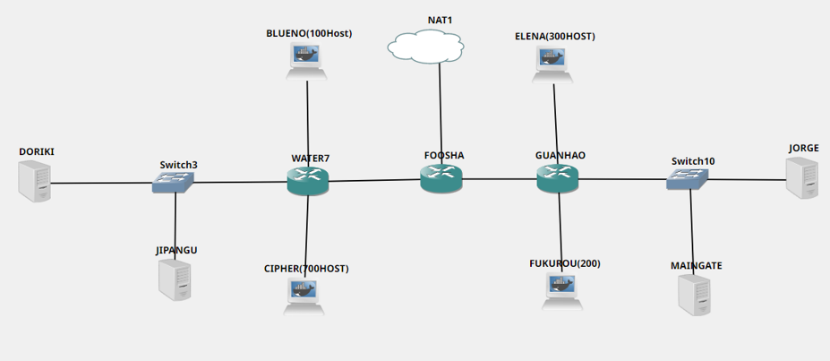
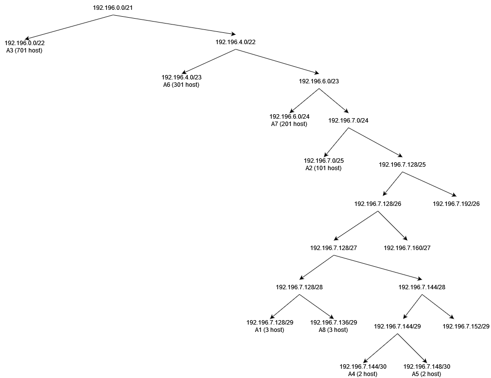

# Jarkom-Modul-5-D09-2021

Nama Anggota | NRP
------------------- | --------------		
Dias Tri Kurniasari | 05111940000035
Nazhwa Ameera H | 05111940000133
Nur Moh. Ihsanuddien | 05111940000142

## A.) Topologi 




## B.) Subnetting
Pembagian subnet pada topologi ini menggunakan metode VLSM.


Dari hasil pembagian subnet, didapatkan sejumlah <b>8 subnet<b>.

### Perhitungan VLSM
1. Menentukan jumlah alamat IP yang dibutuhkan oleh tiap subnet dari 8 subnet yang ada. 

    Subnet | Jumlah IP | Netmask
    -------| --------- | -------	
    A1 | 3 | /29
    A2 | 101 | /25
    A3 | 701 | /22
    A4 | 2 | /30
    A5 | 2 | /30
    A6 | 301 | /23
    A7 | 201 | /24
    A8 | 3 | /29
    Total | 1314 | /21

    Sehingga, kita dapat menggunakan netmask /21 untuk memberikan pangalamatan IP pada 8 subnet.

2. Subnet besar yang kami bentuk memiliki `NID 192.196.0.0` dengan netmask /21. Kemudian, melakukan perhitungan pembagian IP dengan bantuan pohon IP



Sehingga, pembagian IP yang memungkinkan untuk topologi yang ada adalah sebagai berikut:

Subnet | NID | Netmask
-------| --- | -------
A1 | 192.196.7.128 | /29
A2 | 192.196.7.0 | /25
A3 | 192.196.0.0 | /22
A4 | 192.196.7.144 | /30
A5 | 192.196.7.148 | /30
A6 | 192.196.4.0 | /23
A7 | 192.196.6.0 | /24
A8 | 192.196.7.136 | /29
    
## C.) Routing

### Foosha
   

    
### Guanhao
   

    
### Water7
   


## D.) IP DHCP pada subnet Blueno, Cipher, Fukurou, dan Elena

    DHCP Server diletakkan pada Jipangu dengan file konfigurasi `/etc/dhcp/dhcpd.conf` sebagai berikut. Konfigurasi ini digunakan untuk memberikan IP address untuk masing-masing client
```
#Blueno
subnet 192.196.7.0 netmask 255.255.255.128 {
    range 192.196.7.2 192.196.7.126;
    option routers 192.196.7.1;
    option broadcast-address 192.196.7.127;
    option domain-name-servers 192.196.7.130;
    default-lease-time 360;
    max-lease-time 7200;
}

subnet 192.196.7.128 netmask 255.255.255.248 {
}

#Cipher
subnet 192.196.0.0 netmask 255.255.252.0 {
    range 192.196.0.2 192.196.3.254;
    option routers 192.196.0.1;
    option broadcast-address 192.196.3.255;
    option domain-name-servers 192.196.7.130;
    default-lease-time 360;
    max-lease-time 7200;
}

#Elena
subnet 192.196.4.0 netmask 255.255.254.0 {
    range 192.196.4.2 192.196.5.254;
    option routers 192.196.4.1;
    option broadcast-address 192.196.5.255;
    option domain-name-servers 192.196.7.130;
    default-lease-time 360;
    max-lease-time 7200;
}

#Fukurou
subnet 192.196.6.0 netmask 255.255.255.0 {
    range 192.196.6.2 192.196.6.254;
    option routers 192.196.6.1;
    option broadcast-address 192.196.6.255;
    option domain-name-servers 192.196.7.130;
    default-lease-time 360;
    max-lease-time 7200;
}    
```
    

### Soal 1
    
    
### Soal 2
 
### Soal 3  

Pada soal ketiga, kita diminta untuk membatasi  koneksi ICMP DHCP dan DNS Server maksimal 3 secara bersamaan, selebihnya didrop. Kita bisa menyelesaikan soal tersebut dengan iptables di bawah.  
`iptables -A INPUT -p icmp -m connlimit --connlimit-above 3 --connlimit-mask 0 -j DROP`  
  
Dengan keterangan sebagai berikut.  
`-A INPUT` : Menggunakan chain INPUT karena dikonfigurasikan langsung pada Jipangu dan Doriki  

`-p icmp` : Protokol yang digunakan, yaitu icmp (ping)  

`-m connlimit` : Menggunakan rule connection limit  

`--connlimit-above 3` : Limit yang ditangkap paket adalah di atas 3  

`--connlimit-mask 0` : Hanya memperbolehkan 3 koneksi setiap subnet dalam satu waktu  

`-j DROP` : Paket di drop   

  
Lakukan pengetesan dengan ping IP Jipangu/Doriki pada 4 node secara bersamaan. `ping 192.196.7.131`.  
  
  

  

  

  


### Soal 4  

Pada soal keempat, kita diminta untuk membatasi akses ke Doriki yang berasal dari subnet Blueno dan Cipher - hanya diperbolehkan pada pukul 07.00 - 15.00 pada hari Senin sampai Kamis.  Kita bisa menyelesaikan soal tersebut dengan iptables di bawah.  
```
#Jalankan di Doriki
#Cipher A3
iptables -A INPUT -s 192.196.0.0/22 -d 192.196.7.128/29 -m time --timestart 07:00 --timestop 15:00 --weekdays Mon,Tue,Wed,Thu -j ACCEPT
iptables -A INPUT -s 192.196.0.0/22 -j REJECT
#Blueno A2
iptables -A INPUT -s 192.196.7.0/25 -d 192.196.7.128/29 -m time --timestart 07:00 --timestop 15:00 --weekdays Mon,Tue,Wed,Thu -j ACCEPT
iptables -A INPUT -s 192.196.7.0/25 -j REJECT
```
  
  

  

### Soal 5  

Pada soal kelima, kita diminta untuk membatasi akses ke Doriki yang berasal dari subnet Elena dan Fukurou - hanya diperbolehkan pada pukul 15.01 - 06.59 setiap harinya.  Kita bisa menyelesaikan soal tersebut dengan iptables di bawah.  
```
#Elena A6
iptables -A INPUT -s 192.196.4.0/23 -m time --timestart 15:01 --timestop 06:59 -j ACCEPT
iptables -A INPUT -s 192.196.4.0/23 -j REJECT
#Fukurou A7
iptables -A INPUT -s 192.196.6.0/24 -m time --timestart 15:01 --timestop 06:59 -j ACCEPT
iptables -A INPUT -s 192.196.6.0/24 -j REJECT
```
  
Dengan keterangan sebagai berikut.  
`-A INPUT` : Menggunakan chain INPUT karena langsung dikonfigurasi pada Doriki  

`-s 192.196.0.0/22, -s 192.196.4.0/23, -s 192.196.6.0/24, dan -s 192.196.7.0/25`: Alamat asal paket  

`-d 192.196.7.128/29`: Mendifinisikan alamat tujuan dari paket  

`-m time`: Menggunakan rule time  

`--timestart 07:00, 15:01`: Waktu mulai  

`--timestop 15:00, 06:59`: Waktu berakhir  

`--weekdays Mon,Tue,Wed,Thu`: Hari  

`-j ACCEPT`: Paket diterima  

`-j REJECT`: Paket ditolak    

  
Lakukan pengetesan dengan `ping google.com` pada node client setelah tanggal diubah. `date -s "8 nov 2021 10:00:00"`/ `date -s "8 nov 2021 17:00:00"`.  
  
  

  


### Soal 6  

Pada soal keenam, kita diminta agar Guanhou disetting sehingga setiap request dari client yang mengakses DNS Server akan didistribusikan secara bergantian pada Jorge dan Maingate.  
```
iptables -A PREROUTING -t nat -p tcp -d 192.196.7.128 --dport 80 -m statistic --mode nth --every 2 --packet 0 -j DNAT --to-destination  192.196.7.138:80
iptables -A PREROUTING -t nat -p tcp -d 192.196.7.128 --dport 80 -j DNAT --to-destination 192.196.7.139:80
iptables -t nat -A POSTROUTING -p tcp -d 192.196.7.138 --dport 80 -j SNAT --to-source 192.196.7.128:80
iptables -t nat -A POSTROUTING -p tcp -d 192.196.7.139 --dport 80 -j SNAT --to-source 192.196.7.128:80
```   
   
Lakukan pengetesan dengan instalasi apt-get install netcat -y lalu jalankan perintah nc 192.196.7.128 80.  

  

  

  

  

## Error dan Kendala
1. Terkadang salah meletakkan iptables sehingga hasil pengetesan tidak sesuai dengan yang diharapkan.
