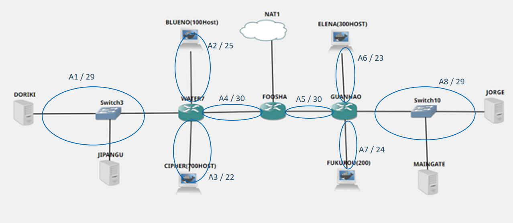

# Jarkom-Modul-5-D09-2021

Nama Anggota | NRP
------------------- | --------------		
Dias Tri Kurniasari | 05111940000035
Nazhwa Ameera H | 05111940000133
Nur Moh. Ihsanuddien | 05111940000142

## Topologi 

## Subnetting
Pembagian subnet pada topologi ini menggunakan metode VLSM.

Dari hasil pembagian subnet, didapatkan sejumlah <b>8 subnet<b>.

### Perhitungan VLSM
1. Menentukan jumlah alamat IP yang dibutuhkan oleh tiap subnet dari 8 subnet yang ada. 

    Subnet | Jumlah IP | Netmask
    -------| --------- | -------	
    A1 | 3 | /29
    A2 | 101 | /25
    A3 | 701 | /22
    A4 | 2 | /30
    A5 | 2 | /30
    A6 | 301 | /23
    A7 | 201 | /24
    A8 | 3 | /29
    Total | 1314 | /21

    Sehingga, kita dapat menggunakan netmask /21 untuk memberikan pangalamatan IP pada 8 subnet.

2. Subnet besar yang kami bentuk memiliki `NID 192.196.0.0` dengan netmask /21. Kemudian, melakukan perhitungan pembagian IP dengan bantuan pohon IP

Sehingga, pembagian IP yang memungkinkan untuk topologi yang ada adalah sebagai berikut:

Subnet | NID | Netmask
-------| --- | -------
A1 | 192.196.7.128 | /29
A2 | 192.196.7.0 | /25
A3 | 192.196.0.0 | /22
A4 | 192.196.7.144 | /30
A5 | 192.196.7.148 | /30
A6 | 192.196.4.0 | /23
A7 | 192.196.6.0 | /24
A8 | 192.196.7.136 | /29

## Error dan Kendala
